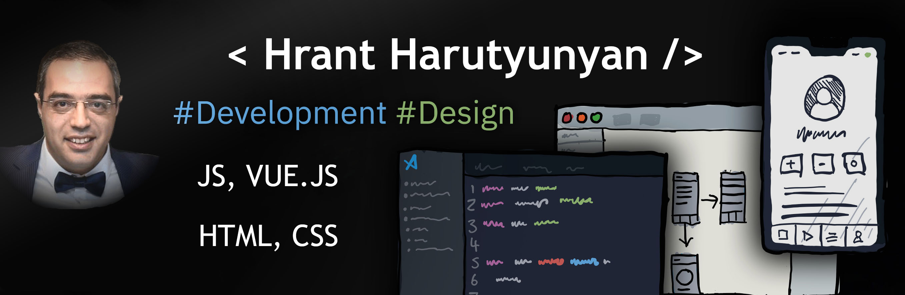

## Hi 👏!  I'm Hrant Harutyunyan.  

---

### 💻 My coding skills:
>
1. Java Script;
2. Vue.js;
3. HTML, CSS

### 🤹 My soft skills: 
>
1. Managing people (*over the 10 years of experience in a big companies*);
2. Offer trainings for students (*over the 15 years of experience in Universities*)

### 📚 Books that influenced me: 
>
+ You don't know JS, Kyle Simpson;
+ Clean Code, Robert Martin;
+ JavaScript for Kids, Nick Morgan;
+ And many other tutorials and documentations in JS, Vue.js etc.
___
### Here is a Dashboard of my GitHub activities:     
>
   
___
### For more information, please fill free to contact:
>
+ 📧 hharuthiunian@gmail.com;
+ 📱 +374 95 555 881;
+ 🔗 <a href="http://linkedin.com/in/hrant-harutyunyan/" target="_blank">Linkedin</a>
___
>
     

___
